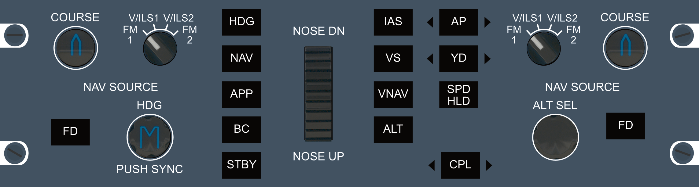
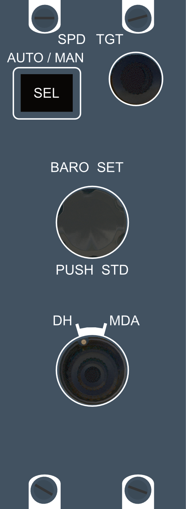
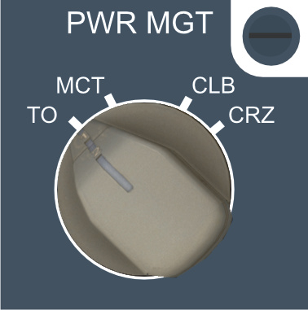
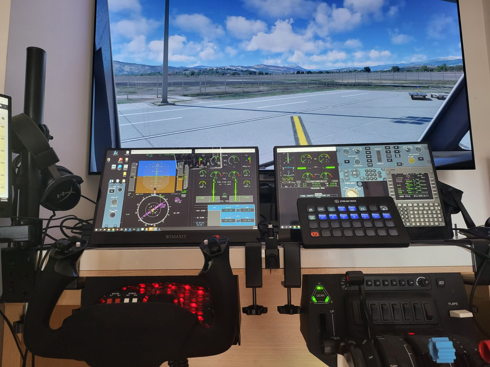

# Asobo ATR 72-600 - AirManager instruments and panels 

Download .siff file from [HERE](ATR_72_BARO_FGCP_PWRMGT.siff) and then import it in [AirManager](https://www.siminnovations.com/).  I made additional instruments to have an easier control of the plane in my cockpit setup - have necessary controls on touch screens for takeoffs and landings and minimize camera switching on main display during time-critical operations. 

Instrument illumination is supported and based on light rotation knob position. This package contains instruments tested for Asobo ATR 72-600 and works in MSFS simulator:

- FGCP panel (Auto-pilot)
- Panel with Spd tgt, Baro set, DH/MDA settings
- PWRMGT panel (Knob only).

MCDU and OVERHEAD panel can be downloaded from other repository [ATRx2-600-AIRMANAGER](https://github.com/Delta-Charlie-DEV/ATRx2-600-AIRMANAGER). Many thanks to the creator and letting others learn making instruments from published code.

> When once you have tasted flight, you will forever walk the earth with your eyes turned skyward, for there you have been, and there you will always long to return.

Leonardo Da Vinci

